# Build Book

> **Projeto:** TechMahindra - Cebrace
>
> **Preparado por:** IBM Build Labs
>
> **Entrega:** 25/10/2022

# Conteúdo
  - [Escopo](#1-Escopo)
  - [Arquitetura](#2-Arquitetura-da-Solução)
  - [Estrutura dos diretórios](#3-estrutura-dos-diretórios)
  - [Configuração do projeto](#4-Configuração-do-Projeto)
    - [Watson Assistant](##-4.1.-Watson-Assistant)
    - [Code Engine](##42-Code-Engine)
    - [Configuração do Webhook](##43-Configuração-do-Webhook)
    - [Cloud Functions](##44-Cloud-Functions)
  - [Referências](#5-referências)

# 1. Escopo
O escopo do MVP é construir um assistente virtual que possa entender os problemas dos clientes, responder aos casos de suporte mais comuns e também atuar na criação de tickets para casos mais complexos.


# 2. Arquitetura da Solução
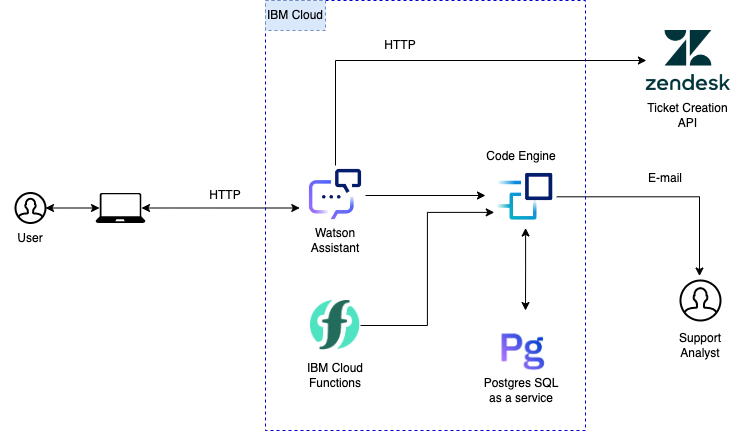

- O Watson Assistant é utilizado para fazer a primeira interação com o cliente e orientar o cliente na resolução de problemas simples.

- Code Engine: É onde uma integração utilizada no Watson Assistant. Essa integração é capaz de receber solicitações e enviar e-mails para analistas humanos.

- Cloud Functions: Faz o envio de e-mails diários para gerentes que precisam aprovar pendências de seus funcionários.

- Postgres: Banco de dados para armazenar a lista de gerentes que precisam ser lembrados.


# 3. Estrutura dos diretórios

```
├── rest_api -  Rest API, Webhook de Integração com o Watson Assistant
├── README.md
├── Microsservices
|    L microsservice.py - Script para usar no Cloud Functions.
├── openapi.json - Arquivo de integração no Watson Assistant.
├── wa_skill_v2.json -  Arquivo de diálogos do Watson Assitant.
└── zendesk.openapi.json - Arquivo de integração com a ferramenta de criação de tickets do Zendesk.
```

---

# 4. Configuração do Projeto

## 4.1. Watson Assistant

O que é o Watson Assistant?
O Watson Assistant é um chatbot que permite construir interfaces de conversação em qualquer aplicativo, dispositivo ou canal. Permitindo adicionar uma interface de linguagem natural ao seu aplicativo para automatizar interações com seus usuários finais. O Watson Assistant, além de fazer essa primeira interação com o usuário, pode ser integrado a outras ferramentas como demonstrado neste MVP.

### 4.1.2. Criação de instância Watson Assistant.
Na página inicial da [IBM Cloud](https://cloud.ibm.com/), procure por "Watson Assistant" na barra de pesquisa.

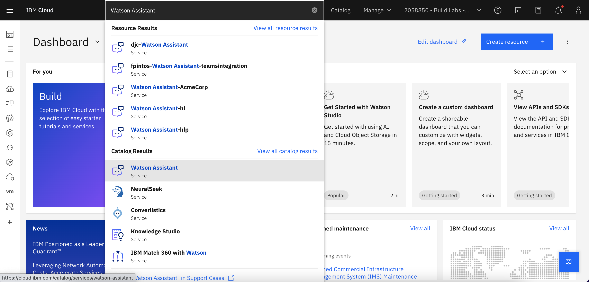

Após isso, você deverá cair na seguinte página.

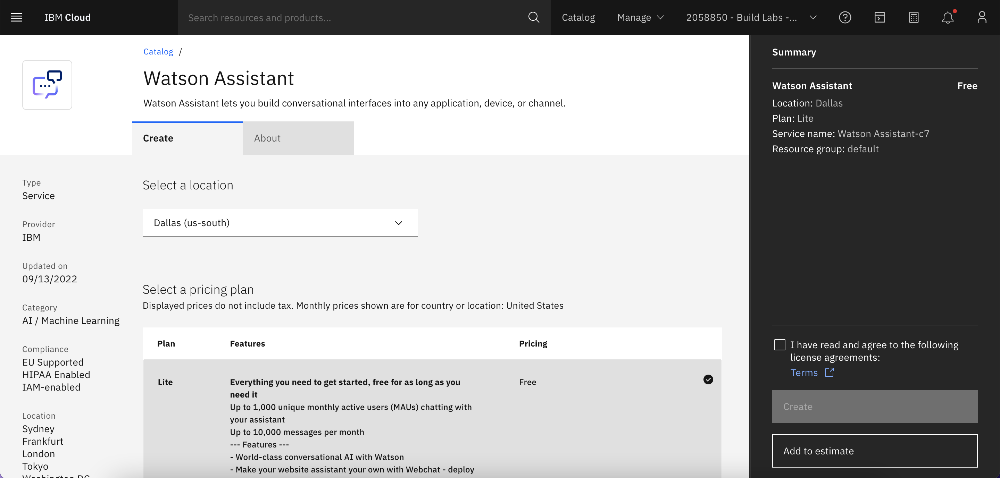

Nesta tela, escolha a região onde seu produto ficará e plano que melhor atende as suas necessidades.

**Nota:** É importante selecionar uma região geograficamente perto de você para uma melhor latência.

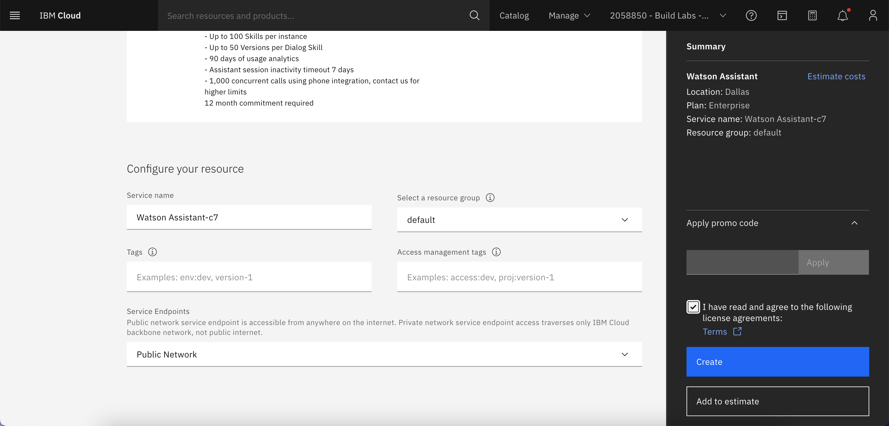

Após escolher o nome do seu serviço e o grupo de recursos, preencha o campo dos termos e condições de uso e clique em `Create`.

Ao criar, você deverá ser redirecionado para a tela da sua instância do seu Watson Assistant.
Ela deve ser parecida com a imagem abaixo.

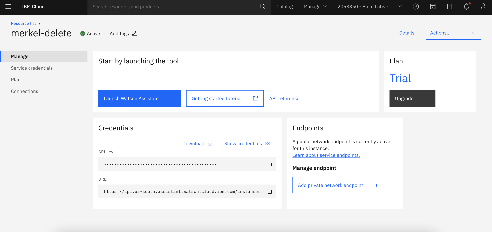

Clique em `Launch Assistant`.

Após isso, você será direcionado para uma tela onde será feita a criação do seu primeiro chatbot.

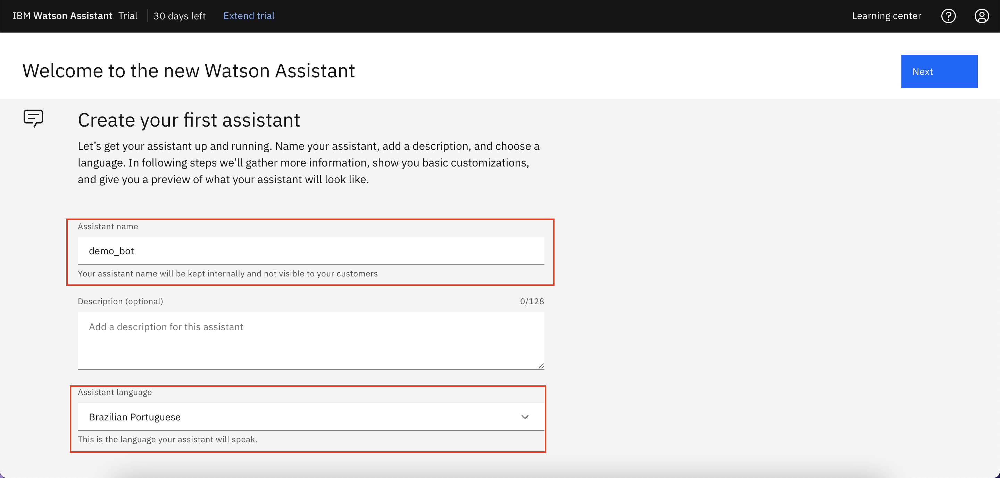

Dê um nome ao seu Watson Assistant e defina a sua linguagem. É muito importante adicionar a linguagem certa ao seu chatbot para que ele entenda melhor os usuários.

Após isso, aperte `Next`. No canto superior direito da tela.

Preencha o questionário inicial, e escolha a aparência do chatbot. Após isso, clique em `Create`.

Após completar o fluxo, deverá se deparar com uma tela conforme abaixo.

**Nota:** É importante salientar que todos os detalhes de aparência podem ser alterados ou atualizados posteriormente.

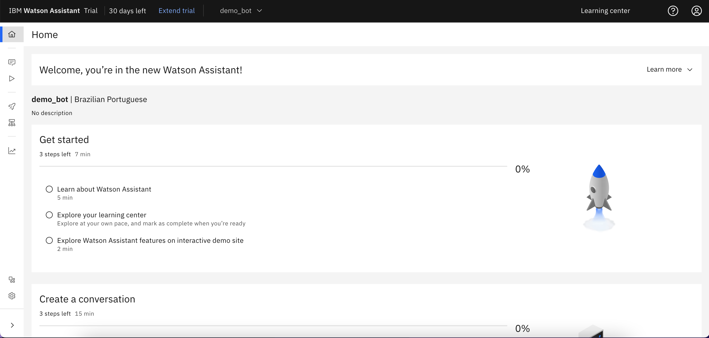

Para importar o MVP ao seu assistant, clique na lateral esquerda, em **actions (passo 1)** , e posteriormente clique no canto superior direito no ícone de **configurações (passo 2)**.

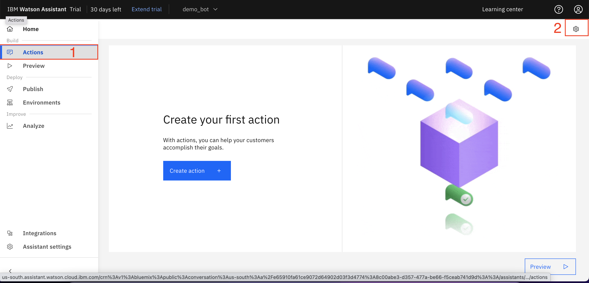

Após isso, vamos importar a skill produzida no mvp para a sua instância do Watson Assistant.
vá para a aba **Upload/Download** e faça o upload do arquivo `wa_skill_v2.json`.

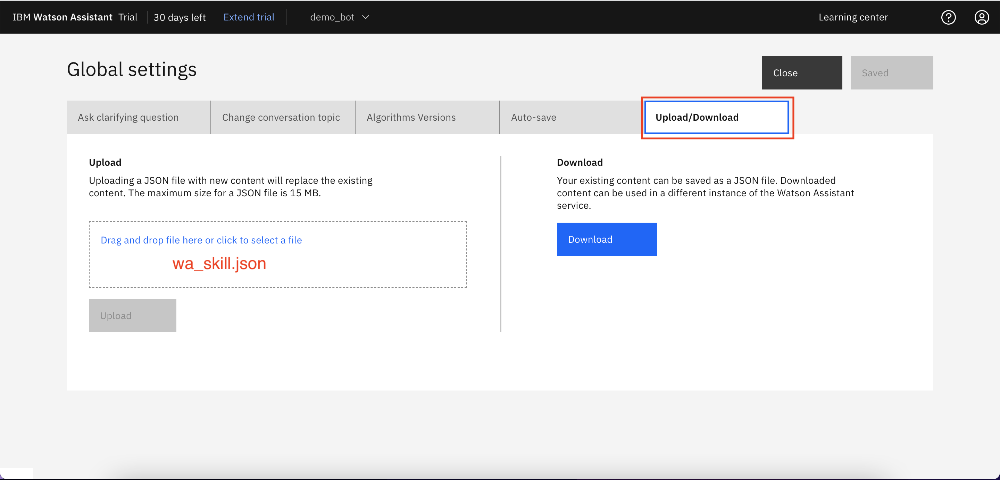

Após fazer o upload e receber uma mensagem de sucesso, clique em **Close**.

Se tudo ocorrer conforme o planejado será possível se deparar com as ações produzidas no MVP na sua página de **Actions**

**Aviso:** As integrações não estão inclusas no `.json`, elas serão configuradas posteriormente, portanto, as ações que necessitam de integração externa não funcionarão nesta etapa.

### 4.2. O que são actions?

Actions são fluxos de diálogo. É com elas que desenvolvemos a resolução de um problema e toda a interação com o usuário.

---
### 4.3. Manutenção de Actions

#### 4.3.1. Adicionando novos exemplos

Caso o Watson Assistant não esteja entendendo muito bem o que os usuários querem dizer, é possível adicionar novos exemplos. Para isso, clique na ação que necessita de melhorias.

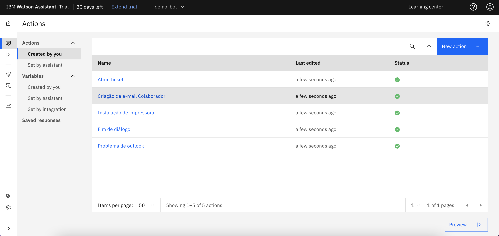


Então, após clicar na ação desejada, será possível encontrar o fluxo de diálogo, nosso foco será o primeiro elemento, aquele que diz `Customer starts with:` conforme a imagem abaixo.

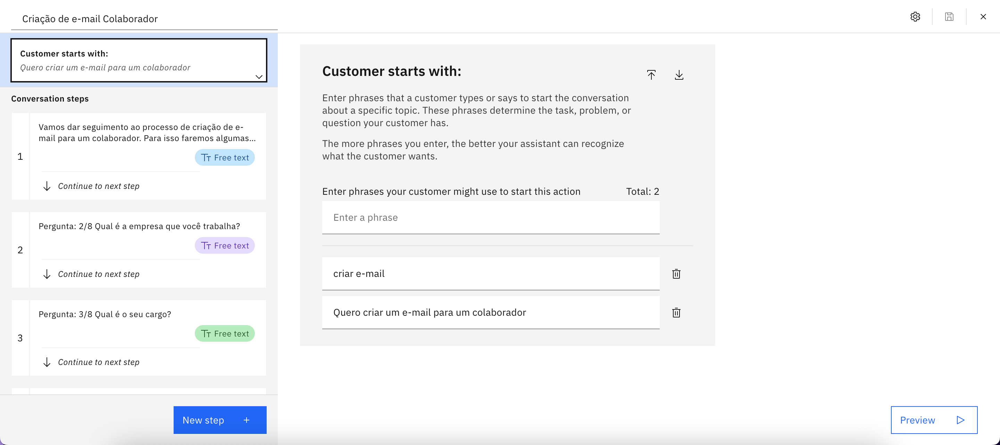

Aqui é possível adicionar exemplos de dialogo que um usuário utilizaria para iniciar uma conversa ou a resolução de um problema. 

O número ideal de exemplos é de 5 a 10.


#### 4.3.2. Adicionando Novos Passos

No canto inferior esquerdo há um botão de `+ New Step`. Clicando nele é possível adicionar um novo passo.

Deve ser parecido com a imagem abaixo

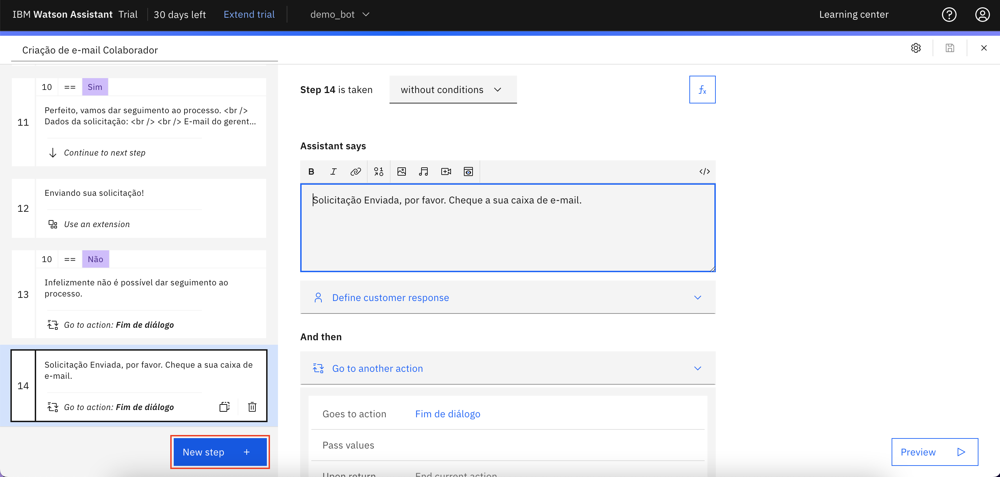

- No primeiro campo definimos se o watson assistant dependerá de uma condição ou não para dizer alguma coisa.


- No segundo campo definimos o que o Watson Assistant irá dizer, o Watson Assistant consegue responder em diversos formatos, incluindo `imagem`, `vídeo`,`áudio`,`iframe`. É importante salientar que, o formato de resposta do Watson Assistant depende do meio de comunicação onde será utilizado (telefone, web chat, sms).

- Em `define customer response` podemos definir se o usuário poderá dar uma resposta para aquela mensagem ou não.

Caso haja alguma necessidade de resposta do usuário é possível definir o tipo de resposta como `opções`,`texto livre`,`validação com regex`, entre outros...


---

## 4.2. Code Engine
O Code Engine é onde será feito o deploy da api rest em python, chamada pelo Watson Assistant.

Para que esta etapa seja realizada corretamente é recomendado que o código fonte esteja no github e caso o repositório seja privado, será necessário gerar uma SSH. Esta etapa da geração da chave SSH não será abordada neste documento, mas [pode ser encontrada neste link](https://docs.github.com/en/authentication/connecting-to-github-with-ssh/adding-a-new-ssh-key-to-your-github-account)

Na página inicial da [IBM Cloud](https://cloud.ibm.com/) clique no menu, no canto superior esquerdo da tela **(Passo 1)**, clique em Code Engine **(Passo 2)** e em Overview **Passo(3)**.

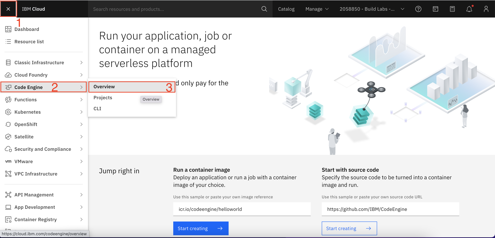

Após isso, na lateral esquerda da página do Code Engine, clique em **Projects** e posteriormente clique em **Create**, como na imagem abaixo

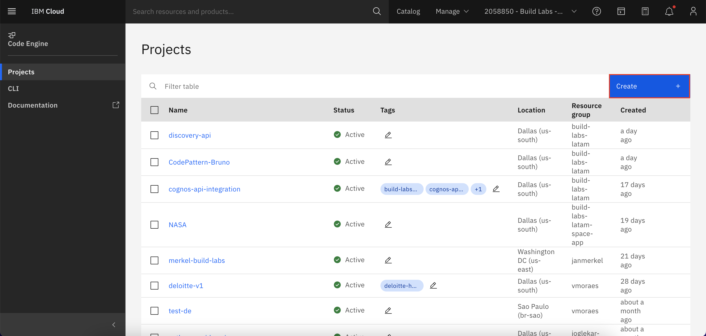

Ao clicar em **Create**, será necessário escolher a localização do seu projeto e dar um nome.

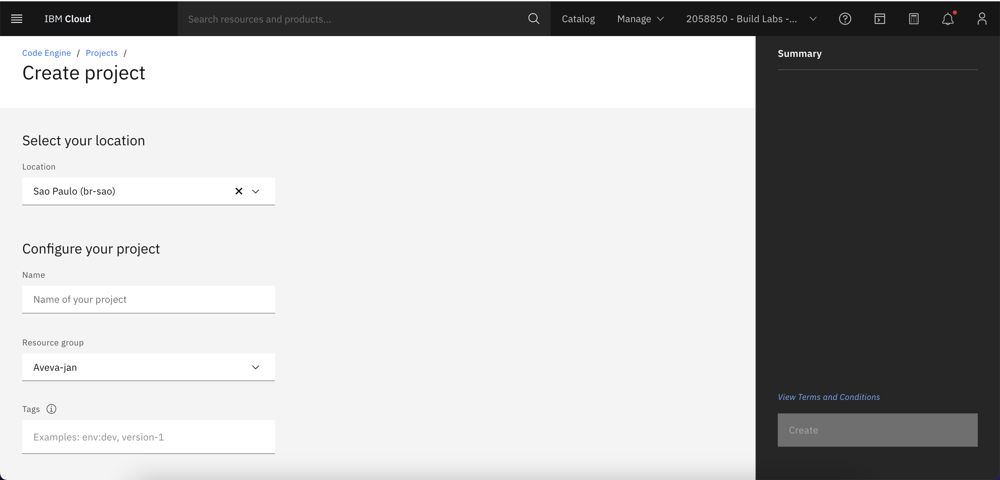

Após isso, clique em criar. Se tudo der certo, deverá ser possível ver o seu projeto, como na imagem abaixo.

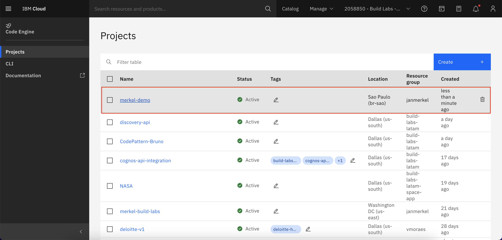

Clique no seu projeto e depois em  **Create Application**

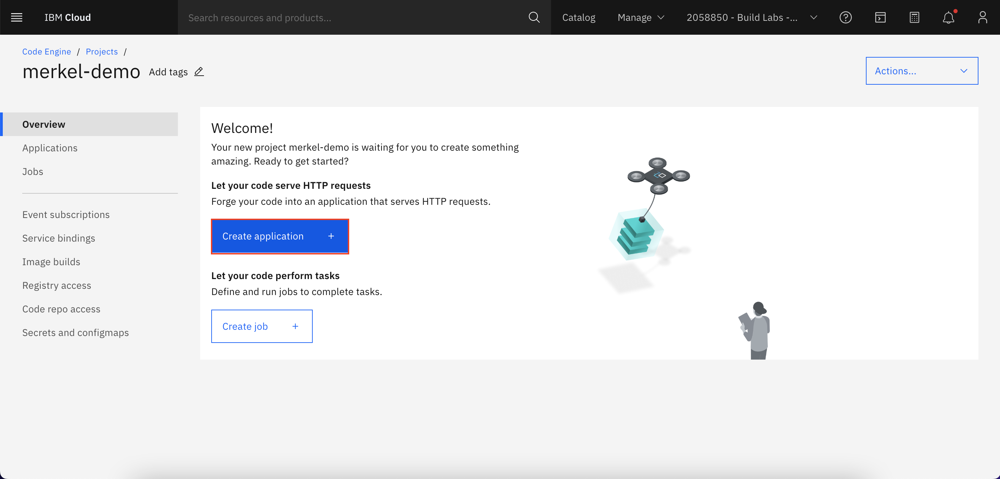


### 4.2.1. Configuração do Ambiente

Dê um nome à sua aplicação e selecione o campo **Source Code**.

Clique em **Specify build details**

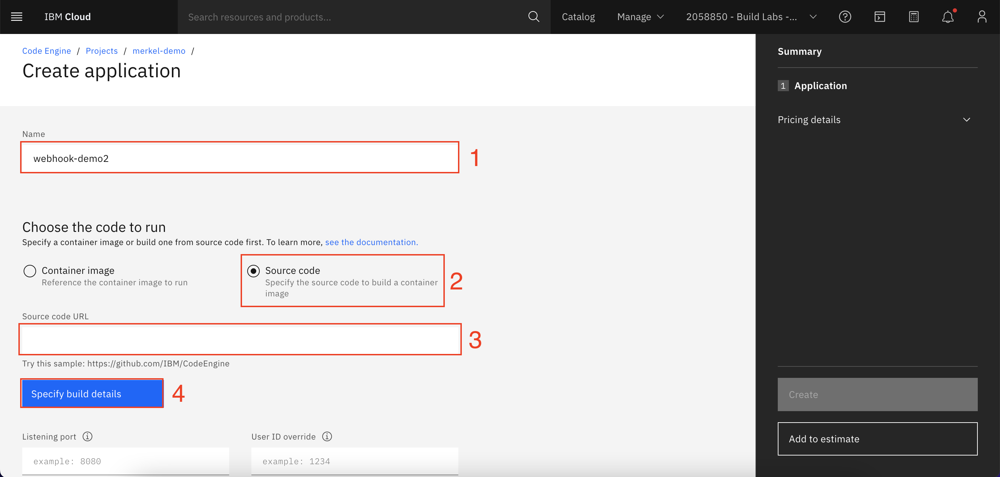

Preencha o URL do repositório.

### 4.2.2. **[Opcional] Configuração de Acesso** 

Caso o repositório seja privado, será necessário configurar o acesso no campo **Code repo access**. 

Para repositórios privados é necessário criar uma chave SSH no github primeiro, veja como fazer [aqui](https://docs.github.com/en/authentication/connecting-to-github-with-ssh/adding-a-new-ssh-key-to-your-github-account).

Copie a sua **Chave privada** e cole no campo conforme a imagem abaixo e clique em **Create**
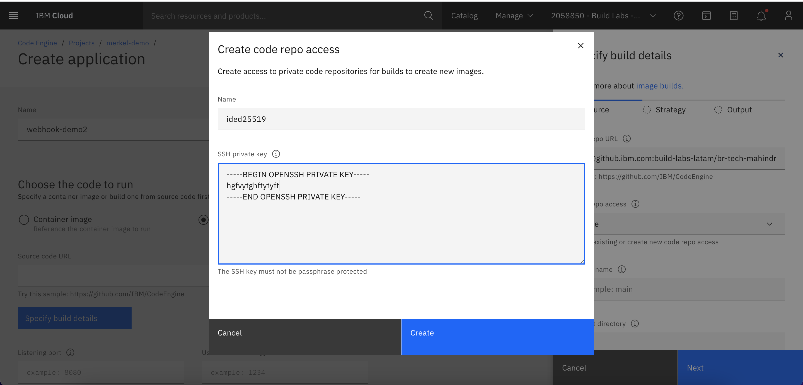


### 4.2.3. Branch e Diretório de Contexto

Escolha o nome da branch que deseja realizar o deploy e o diretório de contexto.

Diretório de contexto, é o diretório onde se encontra a Dockerfile utilizada para montar a aplicação.

Neste caso, o **diretório de contexto** deve ser 

`./rest_api`

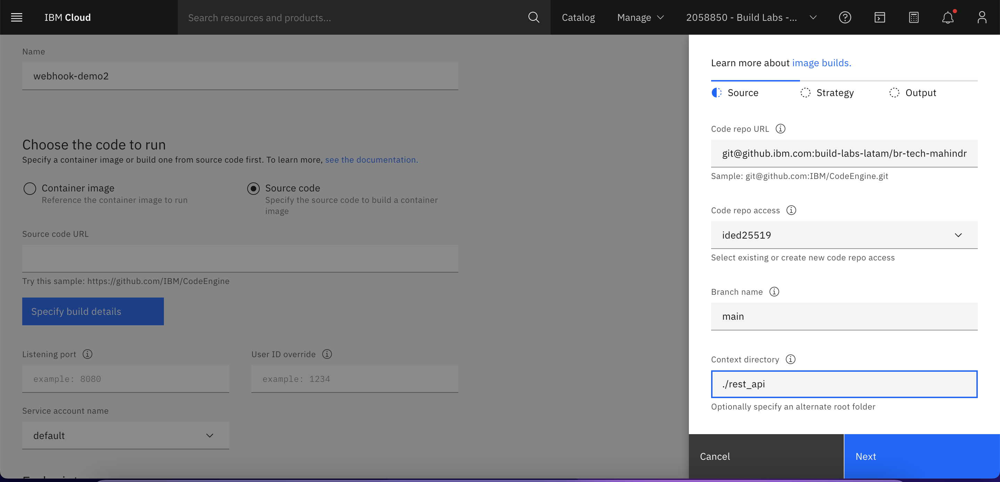

Após preencher os campos necessários, clique em **Next**, você irá para a seção de **Strategy**, nesta seção, escolha a estratégia **Dockerfile**.

Nesta tela é possível escolher a configuração do hardwdare que rodará o seu código. Não é necessário mudar nada.

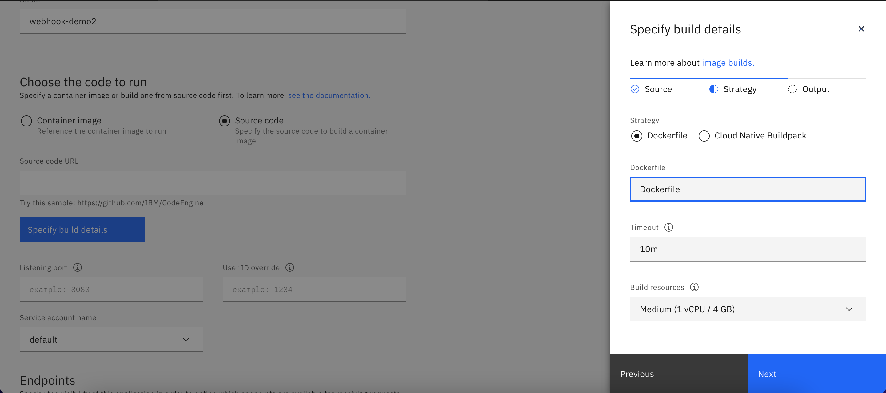

Clique em **Next**

Caso queira, mude os valores da seção de **Output**

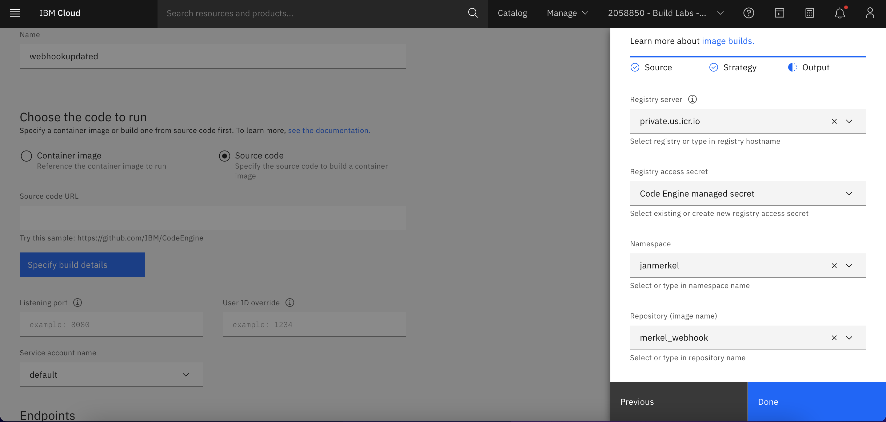

Após isso, clique em **Done**.


### 4.2.4. Porta da aplicação e Variáveis de Ambiente

Mude a porta da aplicação para `5000` e selecione um endpoint público, conforme a imagem abaixo.
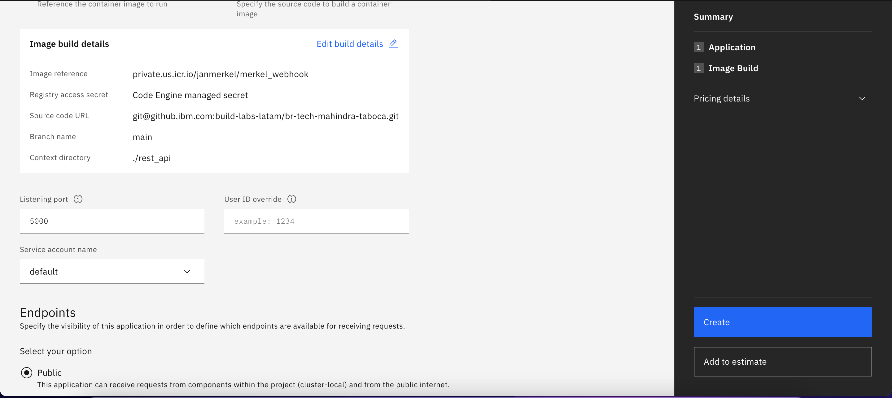

Então abra a seção de **Runtime Settings**.

Para a aplicação funcionar conforme o esperado é necessário adicionar todas as variáveis de ambiente encontradas no arquivo `.env.example`.

Abaixo temos uma descrição das variáveis encontradas no arquivo `.env.example`.

```
MAIL_USERNAME - email do robô
MAIL_PASSWORD - senha do e-mail do robô
PG_USERNAME - usuário do banco de dados Postgres
PG_PASSWORD - senha do banco de dados Postgres
PG_HOST - hostname do banco de dados
PG_PORT - porta do banco de dados
PG_DB - nome do banco de dados
```

Para adicionar uma variável de ambiente clique em **Add**
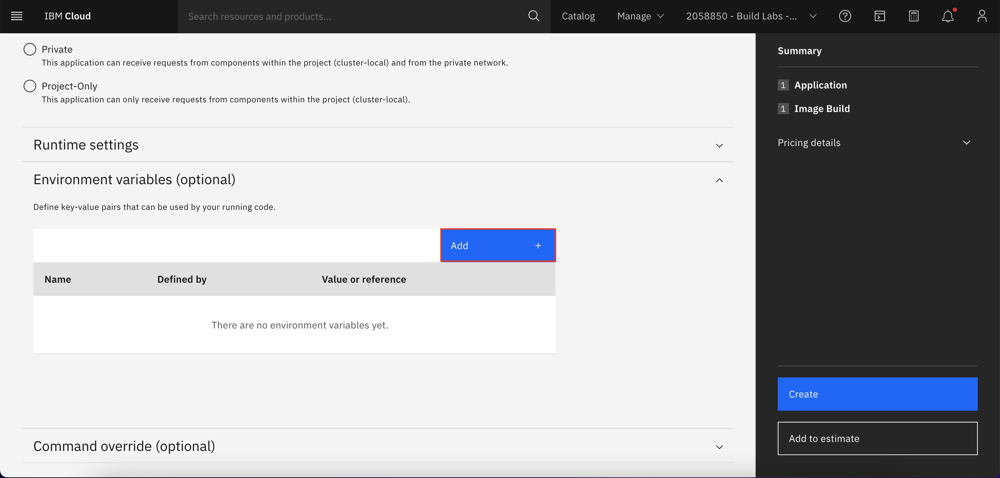

Selecione a opção `Literal Value`, e no primeiro campo, preencha o nome da variável e no segundo campo o valor da variável. Não é necessário colocar o `=`

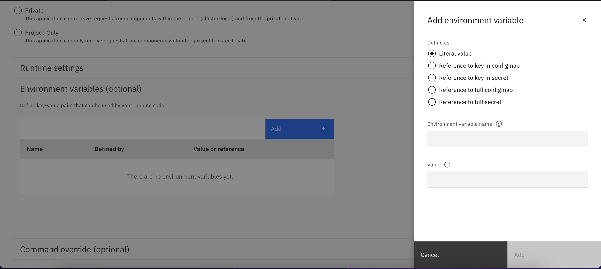


Exemplo:

Campo 1:
```
EMAIL_USERNAME
```

Campo2: 

```
user@dominio.com
```

Após preencher todas as variáveis, esta seção deve se parecer com isto

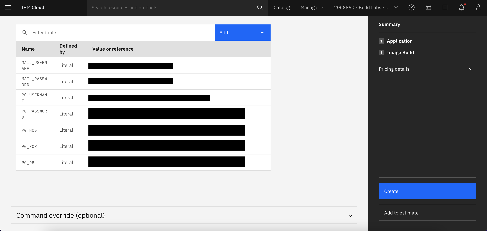

Então, clique em **Create**

Caso tudo ocorra bem, você será direcionado à tela de deploy da sua aplicação. 

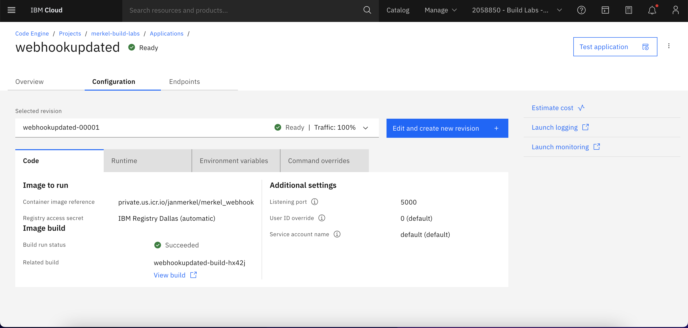

Clique na seção **Endpoints** e obtenha o URL da sua aplicação, usaremos o URL da aplicação para configurar o Webhook do Watson Assistant.


---

## 4.3. Configuração do Webhook

Nesta etapa será configurada a integração do webhook com o Watson Assistant.
Há dois arquivos de webhooks, o `zendesk.openapi.json` e o `openapi.json`.

O `zendesk.openapi.json` é o json de integração com a ferramenta de abertura de tickets zendesk.

O `openapi.json` é o arquivo de integração com a nossa Rest API customizada.

Caso queira criar um webhook próprio, é necessário elaborar um JSON com as rotas disponíveis no padrão **Open API**. Uma ferramenta muito famosa para criar documentações de API neste formato é o [Swagger Editor](https://editor.swagger.io/). O Swagger Editor não é utilizado para criar o backend, somente para documentar e tornar possível o envio de argumentos via Watson Assistant.

Abra o arquivo `openapi.json` e na linha 10, coloque o URL da sua aplicação do Code Engine.

Exemplo:

```
 "servers": [
    {
      "url": "WWW.URL_DA_SUA_APLICAÇÃO.COM",
      "description": "Your application endpoint",
      ...
```

Após trocar a url do JSON, vá para a página do seu Watson Assistant, clique em **Integrations (Passo 1)** e em **Build Custom Extension (Passo 2)**

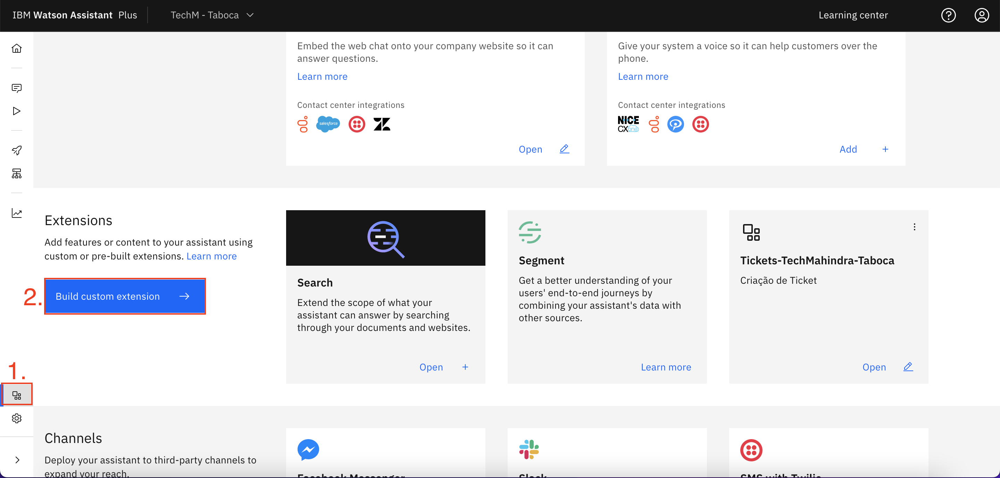

De um nome à sua extensão customizada e uma descrição para poder prosseguir.
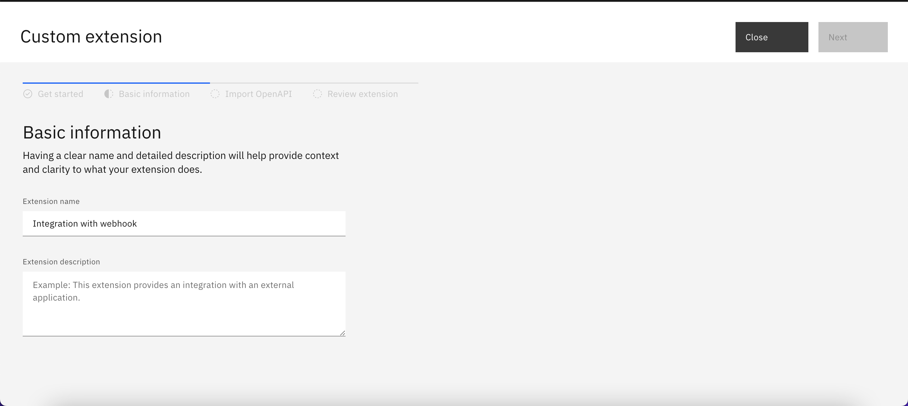

Então, importe o arquivo openapi.json e após completar o upload clique em next.
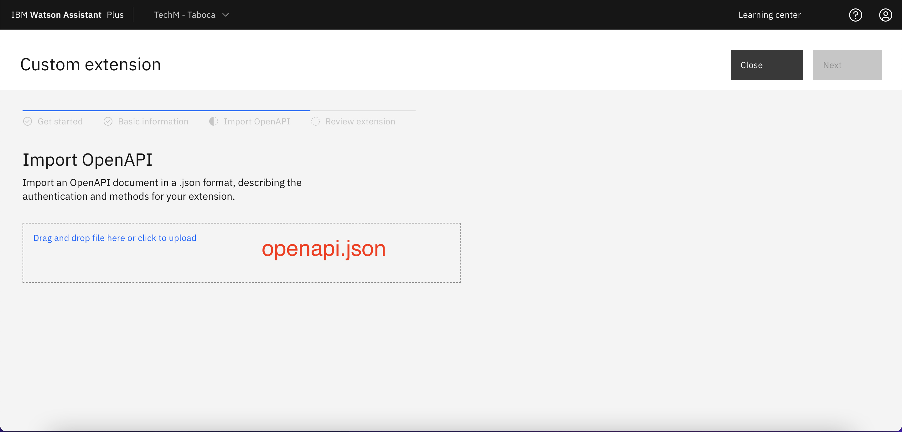


Se tudo ocorrer bem você verá um resumo das rotas acessíveis pelo Watson Assistant.

então clique em **Finish**.
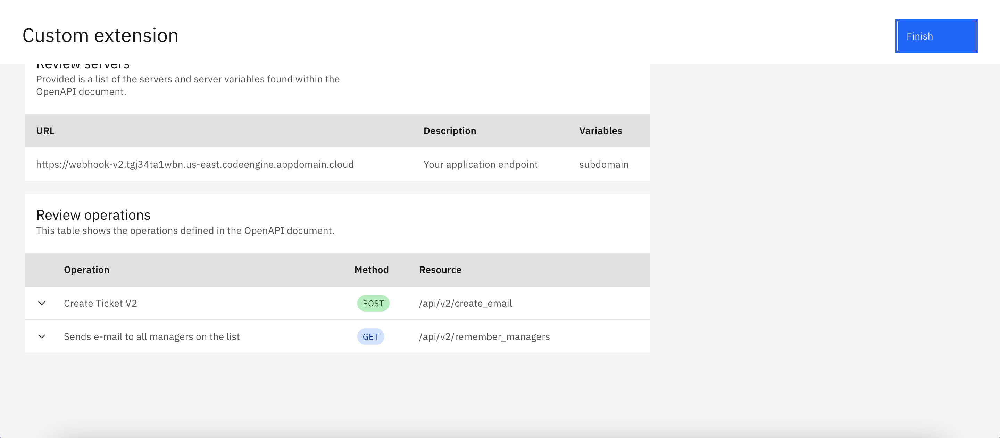


Na página de Integrações do Watson Assistant será possível ver a sua integração mas ela ainda não está em uso. Para isso, precisamos liga-la ao assistente virtual.


Clique em **Add** no card da sua integração e então clique em **next**.
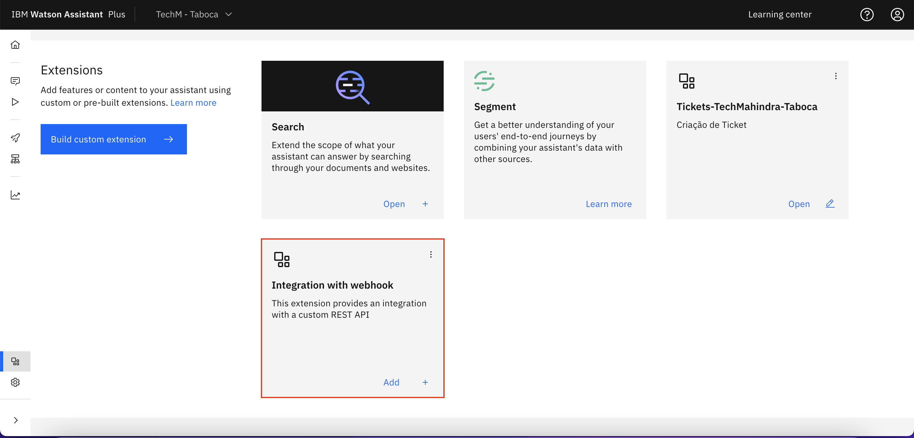

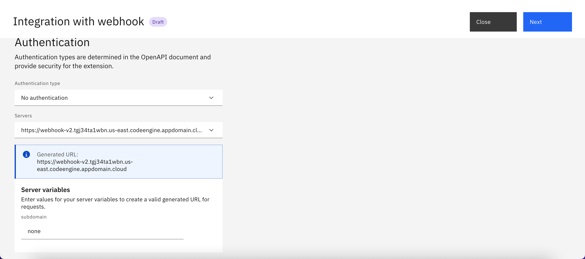

Após adicionar a sua integração ao Watson Assistant, clique em Actions e vá para a action de `Criação de E-mail para colaborador`.

Procure pelo **passo** onde está escrito `Use an Extension`, como na imagem abaixo

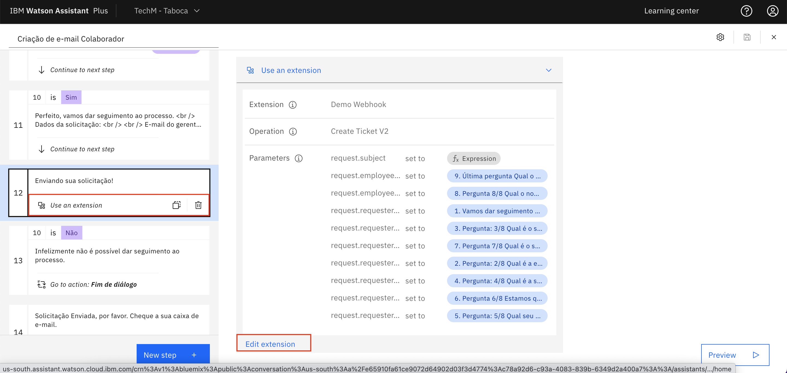

Então clique em **edit extension**, e selecione o webhook desejado, a operação desejada e preencha os campos do webhook de acordo com os campos a serem enviados pela API.

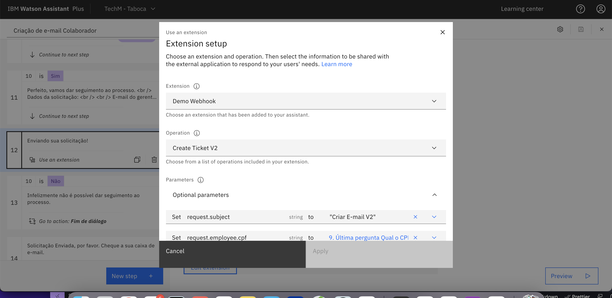


Após configurar todos os campos necessários, clique em **Apply**.

Pronto, o webhook está disponível para uso.

**Nota:** Os passos de configuração do zendesk são quase os mesmos, a única diferença é que em vez de colocar a url do code engine, é necessário colocar a url da aplicação do zendesk.


---

# 4.4. Cloud Functions

Cloud Functions será utilizado para agendarmos chamadas de código.

Por exemplo:
O envio de e-mails de lembretes diários a todos os gerentes.

Para criar uma Cloud Function, vá para a [Home da IBM Cloud](https://cloud.ibm.com/), clique no canto superior esquerdo, no menu e após isso, clique em **Functions**, e então em **Actions** como na imagem abaixo

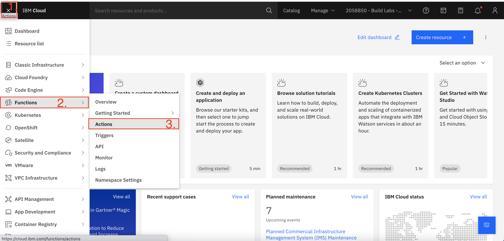

Na página de **Actions** Clique em **Create** e então escolha o nome e o ambiente de execução de código da sua função. Para a execução deste MVP utilizaremos os pacotes padrão e o ambiente de execução `Python 3.9`. Conforme a imagem abaixo

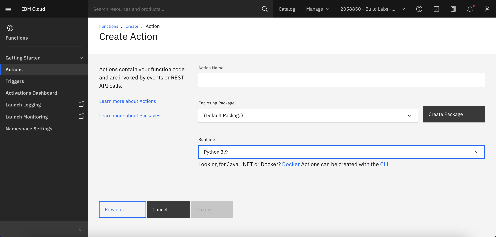

Então, clique em **Create**.

Se tudo der certo, a próxima página deverá se parecer com a imagem abaixo

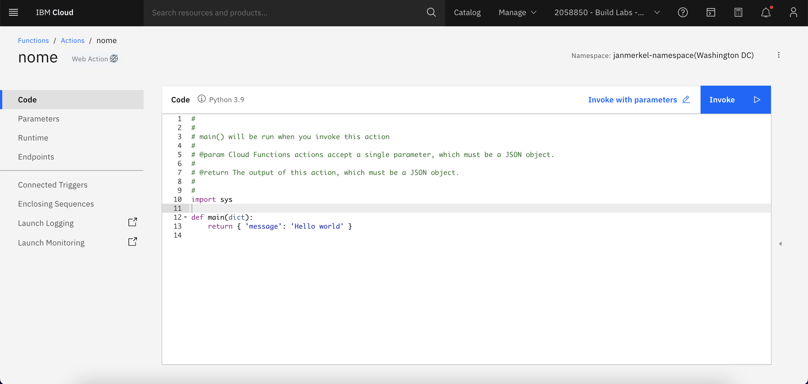

Nesta página, copie o código localizado na pasta `./Microsservices` no arquivo `microsservice.py`
e substitua pelo código atual.

**Nota:** Não se esqueça de mudar a URL padrão para o seu endpoint do Code Engine.

Após finalizar as mudanças no seu código, clique em **Salvar**.

É possível testar o código clicando em **Invoke**.

Ao invocar a função, enviaremos lembretes para os gerentes dos funcionários. Para agendarmos esse envio de lembretes, usaremos **Triggers**.

Para adicionar um **Trigger** à sua função, clique em **Connected Triggers**, no canto esquerdo da tela e então, clique em **Add Trigger** no canto superior direito da tela.

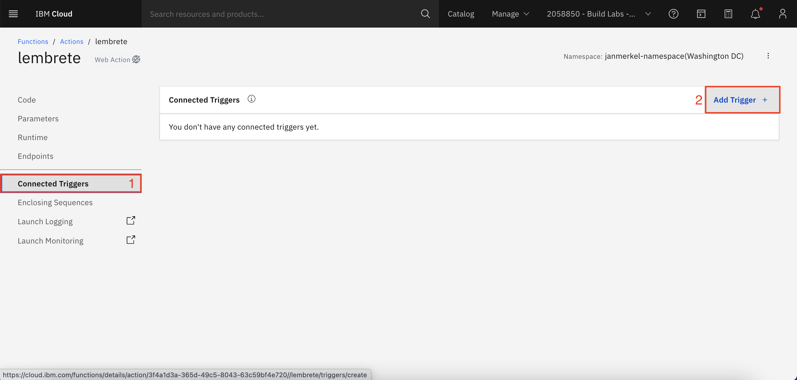

Há diversos tipos de Trigger. O Trigger abordado neste documento será o de invocação **Periódica**.

Selecione a opção **Periodic**, conforme a imagem abaixo.

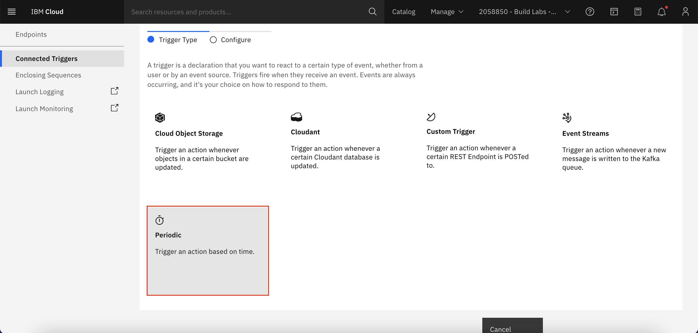

Então será possível escolher os dias da semana que deseja invocar a função e o horário.

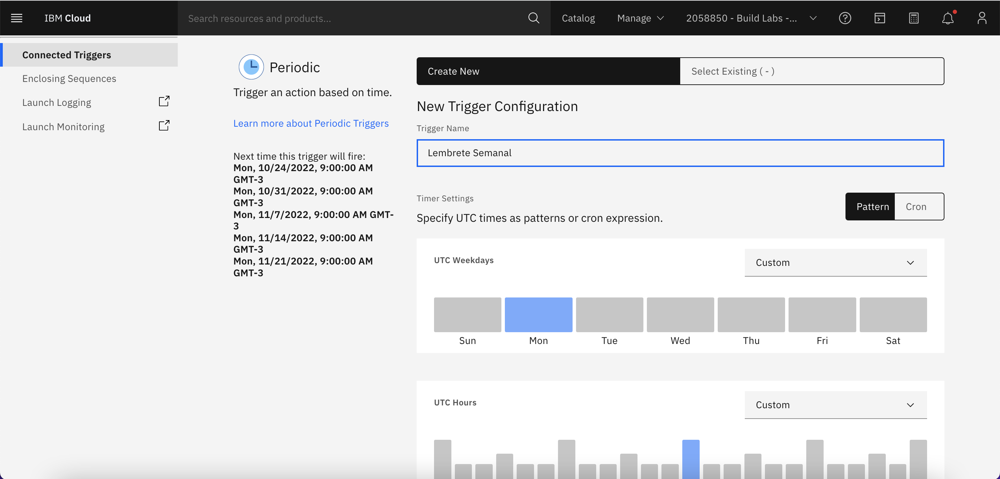

Após selecionar os dias e os horários de Invocação desta Função clique em **Create & Connect**.

Os lembretes serão enviados de acordo com a sua configuração.


# 5. Referências
1. [Swagger Editor](https://editor.swagger.io/)
2. [SSH Github](https://docs.github.com/en/authentication/connecting-to-github-with-ssh/adding-a-new-ssh-key-to-your-github-account)
3. [Watson Assistant](https://cloud.ibm.com/docs/watson-assistant)
